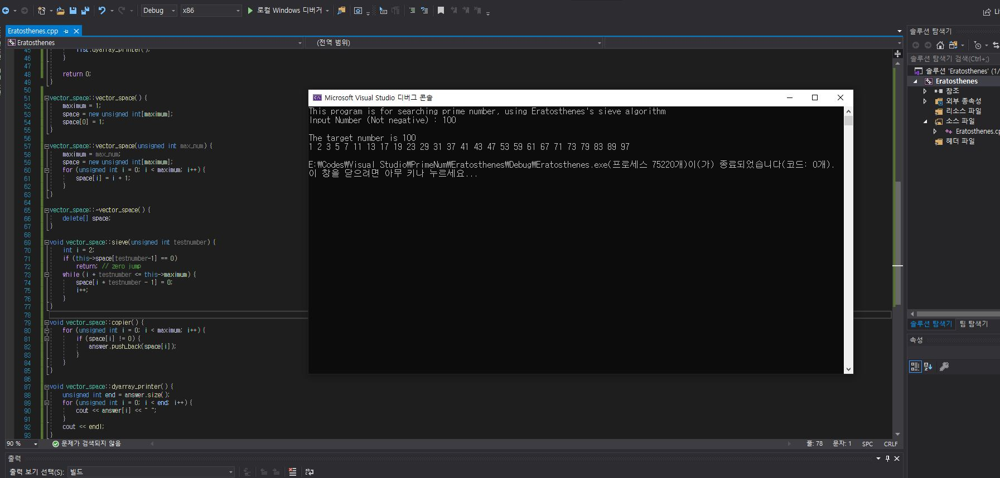

# Finding Prime Number  
## Created on Jan. 11th. 2020. Windows VS  

using Eratosthenes's sieve (에라토스테네스의 체) algorithm, this program will find prime numbers.  
you just enter the positive integer as a input. and automatically search prime_nums from 1 to input.  
  