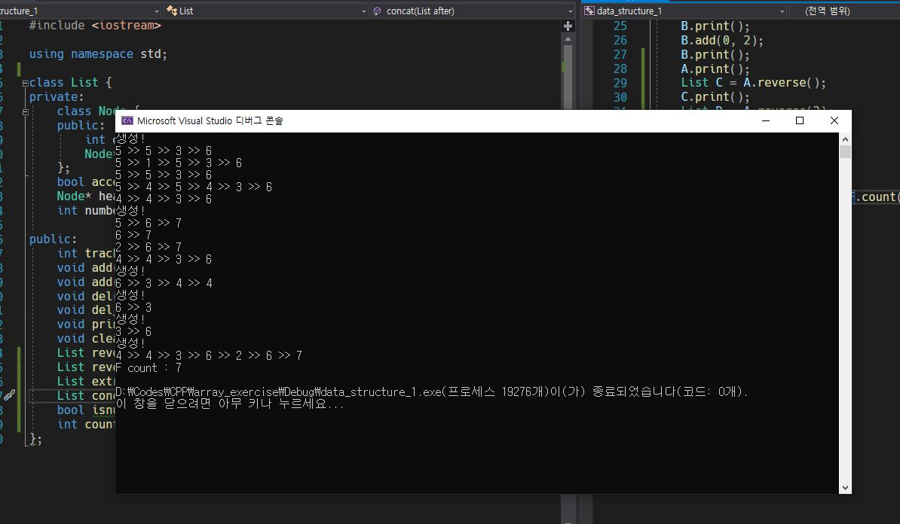

# Simply-connected Linked-list
## Created on April. 25th. 2020. Windows VS

### field
1. Node  
	- data : substantive value in list  
	- link : next address  
2. access_valid  
	- check invalid index access  
3. head  
	- head pointer : starting point of list  
4. numbers  
	- numbers of element in list  

### method
1. tracking : return first index that has a data you want.  
2. add : attach a node to the tail.  
3. add(index) : insert a node after desired index.  
4. del : delete a node at the desired index.  
5. del_all : delete all data that user want in the list.  
6. print : display all element in the list.  
7. clean : delete the list in memory.  
8. reverse : reverse the order of the list.  
9. reverse(index) : reverse the order of the list at the index you want.  
10. extract : extract a list at the index you want.  
11. concat : A.concat(traget) = A + target : concatenation.  
12. isnull : return true if list is empty.  
13. count : return the number of element in list.  

  