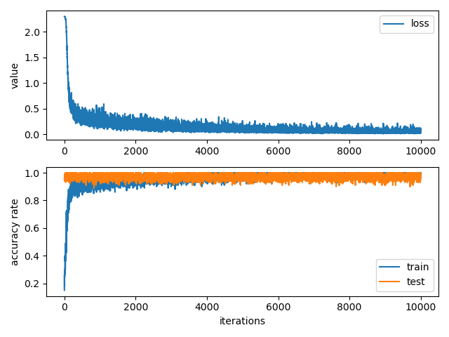

# MNIST Deep-Learning Model
## Created on Jan. 30th. 2020, Windows Pycharm
### referenced <ゼロから作る Deep Learning - Saito goki>

This model will download MNIST images from [MNIST Database](http://yann.lecun.com/exdb/mnist/)  

Run testbench.py  

First, The model downloads images. if there are images already, it just read pkl file.  
Second, The model trains 10,000 training images.  
Third, The model is tested by test images.  
Fourth, The model shows trace value per iterations.  

